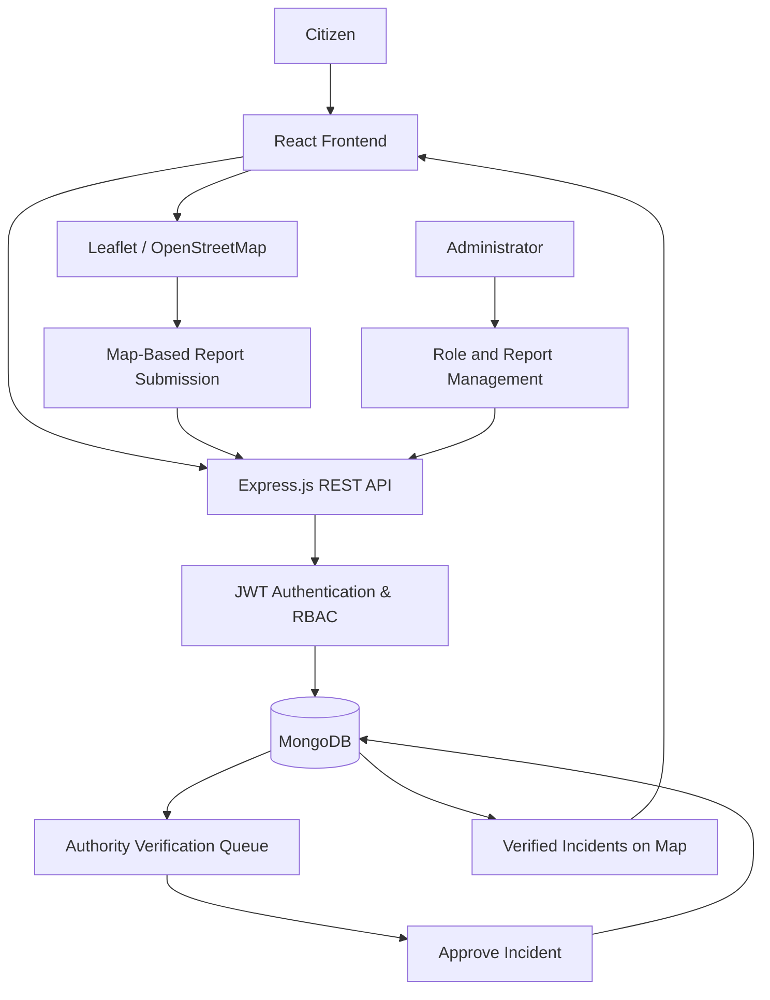

<div align="center">

#  TRACE

### Technology for Reporting, Analysis & Crime Evaluation

**A secure, location-aware platform connecting citizens and law enforcement through actionable incident reporting.**

<p>
  
  
  
  
</p>

<p>
  <a href="#-key-features">Features</a> •
  <a href="#-tech-stack">Tech Stack</a> •
  <a href="#-project-structure">Structure</a> •
  <a href="#%EF%B8%8F-installation--setup">Setup</a> •
  <a href="#-api-reference">API Reference</a>
</p>

</div>

---

## 📌 Overview

**TRACE** is a full-stack Geospatial Crime Reporting & Analysis Platform designed to bridge the gap between citizens and law enforcement. Citizens can securely submit location-based crime and hazard reports using anonymous public-facing aliases, while authorized personnel can review, verify, and manage submitted incidents through role-specific workflows.

With interactive maps, viewport-aware incident retrieval, JWT-based access control, and structured audit logging, TRACE is built to make incident reporting more accessible and incident management more efficient.

> [!NOTE]
> Citizen aliases provide **public-facing pseudonymity**, not absolute anonymity. Account information remains part of the system, subject to its access controls and data-handling policies.

---

## ✨ Key Features

| Feature | Description |
| :--- | :--- |
| 🕵️ **Citizen Privacy** | Registered users receive auto-generated aliases (for example, `CITIZEN-8A3B9`) so their real identities are not displayed alongside public reports. |
| 🗺️ **Interactive Incident Maps** | React-Leaflet and OpenStreetMap support click-to-pin reporting, reverse geocoding with Nominatim, and dark-mode map styling. |
| ⚡ **Viewport-Optimized Queries** | MongoDB `2dsphere` indexes and `$geoWithin` bounding-box queries retrieve incidents within the visible map region instead of fetching the entire dataset. |
| 🔐 **Role-Based Access Control** | JWT-based authentication and role guards provide separate workflows for citizens, authorities, and administrators. |
| 🛡️ **Security-Focused Authentication** | HTTP-only authentication cookies, configurable SameSite policies, `bcrypt` hashing, and CORS configuration help protect sensitive application flows. |
| 📜 **Audit Logging** | Morgan request logging and dedicated Winston loggers organize system errors, administrator actions, and authority activities. |

### 👥 User Roles

| Role | Capabilities |
| :--- | :--- |
| **Citizen** | Register, authenticate, submit geolocated reports, and view verified nearby incidents. |
| **Authority** | Access reports pending verification and approve incidents for display. |
| **Admin** | Manage system roles and delete incidents when necessary. |

---

## 💻 Tech Stack

| Category | Technologies |
| :--- | :--- |
| **Frontend** | React 18, Vite, React Router DOM v6 |
| **Mapping & Geocoding** | Leaflet, React-Leaflet, OpenStreetMap, Nominatim API |
| **Backend** | Node.js, Express.js |
| **Database** | MongoDB, Mongoose, Geospatial Queries |
| **Authentication & Security** | JWT, HTTP-Only Cookies, bcrypt, CORS |
| **Logging** | Morgan, Winston (Role-Specific Loggers) |

---

## 🏗️ System Workflow



**Report lifecycle:** `Citizen submits report` → `Report awaits verification` → `Authority reviews report` → `Approved incident appears on the map`.

---

## 📂 Project Structure

```text
TRACE/
├── backend/
│   ├── config/          # Database, authority, and CORS configuration
│   ├── controllers/     # Authentication, report, and admin logic
│   ├── middlewares/     # JWT verification and RBAC guards
│   ├── models/          # Mongoose schemas (Users, CrimeReports)
│   ├── routes/          # Express API routers
│   ├── utils/           # Winston logging utilities
│   └── server.js        # Express application entry point
│
└── frontend/
    ├── src/
    │   ├── components/  # Shared UI: AppHeader, AuthShell, MapDataFetcher
    │   ├── context/     # Shared authentication state (AuthContext)
    │   ├── pages/       # Login, Register, Report, ViewIncidents
    │   ├── services/    # API request helpers
    │   └── utils/       # Map config, geocoding, and distance utilities
    └── vite.config.js   # Vite configuration
```

---

## 🛠️ Installation & Setup

### Prerequisites

Make sure you have installed:

- **Node.js** and **npm**
- **MongoDB**, running locally or accessible through a connection URI
- **Git**

### 1. Clone the Repository

```bash
git clone https://github.com/yourusername/TRACE.git
cd TRACE
```

> Replace `yourusername` with your actual GitHub username or repository URL.

### 2. Configure the Backend

```bash
cd backend
npm install
```

Create a `.env` file inside the `backend/` directory:

```dotenv
SERVER_PORT=3500
MONGO_URI=mongodb://127.0.0.1:27017/trace_db
JWT_SECRET_KEY=replace_with_a_long_random_secret
NODE_ENV=development
```

> [!IMPORTANT]
> Never commit `.env` files, JWT secrets, database credentials, or real citizen identifiers to version control. Configure CORS, cookie `Secure`/`SameSite` attributes, and HTTPS appropriately before production deployment.

Start the backend development server:

```bash
npm run dev
```

The backend is configured to use port **3500** with the example environment above.

### 3. Start the Frontend

Open another terminal from the repository root:

```bash
cd frontend
npm install
npm run dev
```

By default, Vite typically serves the frontend at **http://localhost:5173**.

> Ensure frontend API requests target your running Express backend and that the backend permits the frontend origin through its CORS configuration.

---

## 📡 API Reference

The following table lists the application routes provided in the project description. Protected endpoints require an authenticated session; role-restricted endpoints additionally require the appropriate role.

### 🌐 Public Routes

| Method | Endpoint | Description |
| :---: | :--- | :--- |
| `POST` | `/registeruser` | Register a citizen and generate a unique alias. |
| `POST` | `/loginuser` | Authenticate a user and set an HTTP-only JWT cookie. |
| `GET` | `/nearbyincidents/nearby` | Retrieve verified incidents within the supplied map bounds. |

### 👤 Citizen Routes — Authentication Required

| Method | Endpoint | Description |
| :---: | :--- | :--- |
| `POST` | `/reportcrime/` | Submit a crime report with geospatial coordinates. |

### 👮 Authority Routes — Authentication + RBAC

| Method | Endpoint | Description |
| :---: | :--- | :--- |
| `GET` | `/getreports/` | Retrieve reports awaiting verification. |
| `PATCH` | `/updatereport/:incident_id` | Verify and approve a pending incident. |

### 👑 Admin Routes — Authentication + RBAC

| Method | Endpoint | Description |
| :---: | :--- | :--- |
| `DELETE` | `/deletereport/:incident_id` | Permanently delete an incident. |
| `PATCH` | `/authorizerole/` | Update a user's assigned role. |

---

## 🔒 Privacy & Security Considerations

- **Pseudonymity:** Public aliases separate displayed reports from real user names; they do not eliminate server-side identification or metadata.
- **Credential protection:** Passwords and sensitive identifiers should be hashed using appropriately designed, field-specific data handling. Hashing Aadhaar identifiers alone does not guarantee anonymity.
- **Session protection:** HTTP-only cookies help mitigate token theft through client-side JavaScript. CSRF protection still depends on correct SameSite settings and, where needed, additional CSRF defenses.
- **Authorization:** Server-side JWT validation and role checks should be applied to all protected actions.
- **Accountability:** Audit logs should avoid exposing secrets or sensitive personal data.

---

## 👨‍💻 Author

**Raj Aryan Tiwari**  
B.Tech — Computer Science and Engineering  
Bharati Vidyapeeth (Deemed to be University) College of Engineering, Pune

---

<div align="center">
  <p><strong>🚨 TRACE — Turning location-based reports into actionable insights.</strong></p>
</div>
